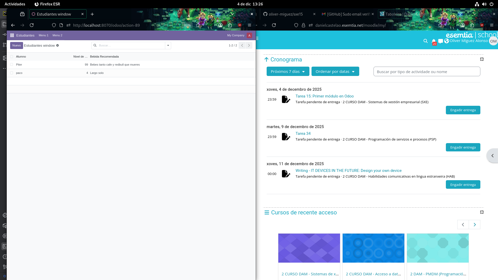

# Observando si se creo correctamente el módulo:

Si nuestro módulo funcionó correctamente lo podremos ver creado y en pleno funcionamiento en odoo,
permitiéndonos añadiendo nuevos alumnos con su respectivo nivel de sueño que calcula automáticamente
la bebida que necesita.

# Utilidades

Plugin en pycharm

Utilizar scaffold y crear módulo

Además de incluir las modificaciones que hice en el modelo del módulo para integrar los campos de alumnos, bebida recomendada y nivel de sueño